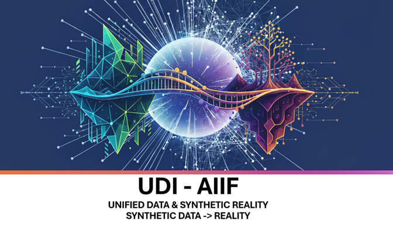

<h1 align="center">Atsu Vovor - Project Portfolio</h1>
  

  

#### *This complex visual identity combines the 'Nexus of Data' and 'Bridge Builder' motifs to represent the **centralization of data inputs** and the **AI-augmented synthesis** used to bridge the gap between simulation and real-world insight.*

Visit the Live Site: Click here to access the portfolio homepage: https://atsuvovor.github.io/projects_portfolio.github.io/
---
# Overview
Welcome to my technical project portfolio! This repository serves as a centralized showcase of my skills, expertise, and completed projects across various domains including data analysis, machine learning, web development, and cybersecurity.

This portfolio is hosted directly on GitHub Pages and is designed to provide interactive demonstrations, detailed case studies, and code access for each project. Whether you are a recruiter, a fellow developer, or just curious, this page offers a deep dive into my practical capabilities.  

I specialize in advancing the technical foundations of AI and data science through the **Unified Data Integration & AI-Augmented Insights Framework (UDI-AIIF)**.

My core focus is the synergistic application of **Generative AI and statistical–mathematical modeling** to produce **high-fidelity synthetic data**. This capability is instrumental in supporting complex analytical simulations and bridging the critical gap between conceptual models and real-world intelligence.

My commitment to **methodological rigor and reproducibility** is central to UDI-AIIF's mandate, emphasizing robust data governance and code practices. I am keenly interested in collaborating with industry professionals and researchers dedicated to the practical implementation of innovation-driven, reproducible AI systems.

---

# 🚀 Key Features
Interactive Demos: Experience live web applications, data visualizations, and simulations directly in the browser.

**Detailed Case Studies:** Each project links to a dedicated page outlining the Problem Statement, Technical Approach, Tools Utilized, and Results/Impact.

**Structured Navigation:** Easily filter and browse projects by technology stack (e.g., Python, JavaScript, React, Power BI) or domain (e.g., Cybersecurity, Finance, Healthcare).

**Responsive Design:** Optimized for viewing on desktop, tablet, and mobile devices.

## Project Domains  
This portfolio currently features work primarily in these areas:  

1. Cybersecurity & Risk Analysis  
    Focus: Simulating attacks, analyzing threat data, and implementing risk mitigation strategies.

    Example Project: Cyber Attack Simulation Dashboard (Power BI) - Demonstrates transforming raw data into actionable security intelligence using Power Query and DAX, as discussed in our previous conversation.  

2. Data Science & Machine Learning  
    Focus: Building predictive models, performing exploratory data analysis (EDA), and creating data pipelines.  
    Technologies: Python (Pandas, NumPy, Scikit-learn), Jupyter Notebooks.  

3. Web Development & Visualization  
    Focus: Creating responsive front-end applications and interactive dashboards.  

    Technologies: HTML, CSS (Tailwind CSS), JavaScript, React, Angular.

# 🛠️ Technology Stack
The projects within this portfolio leverage a diverse set of modern tools and frameworks:

## Category

**Key Technologies Used**

1.   Data & AI

*      Python, Pandas, NumPy, Scikit-learn, TensorFlow/PyTorch

2.   Business Intelligence

  *     Power BI (Power Query, Power Pivot/DAX), Tableau

3.   Front-End

  *     React, Angular, JavaScript (ES6+), HTML5, Tailwind CSS

4.   Backend/Cloud

  *     Firebase (Firestore, Authentication), Node.js, REST APIs

5.   Version Control

  *     Git, GitHub

## 🏃 Getting Started (Navigation)
To explore the portfolio:

Visit the Live Site: Click here to access the portfolio homepage: https://atsuvovor.github.io/projects_portfolio.github.io/

Browse Projects: Use the navigation bar or category filters to select a project of interest.

View Source Code: For any specific project, look for the 'View Code' or 'GitHub' link, which will direct you to its dedicated repository within my portfolio.

##  🤝 Connect With Me
I am always open to collaboration and discussion about new projects or technical roles.

Atsu Vovor  
Consultant, Data & Analytics   
Ph: 416-795-8246 | ✉️ atsu.vovor@bell.net  
🔗 [LinkedIn ](https://www.linkedin.com/in/atsu-vovor-mmai-9188326/)|   [GitHub](https://atsuvovor.github.io/projects_portfolio.github.io/) |   [Tableau Portfolio](https://public.tableau.com/app/profile/atsu.vovor8645/vizzes)  
📍 Mississauga ON   

### Thank you for visiting!🙏
